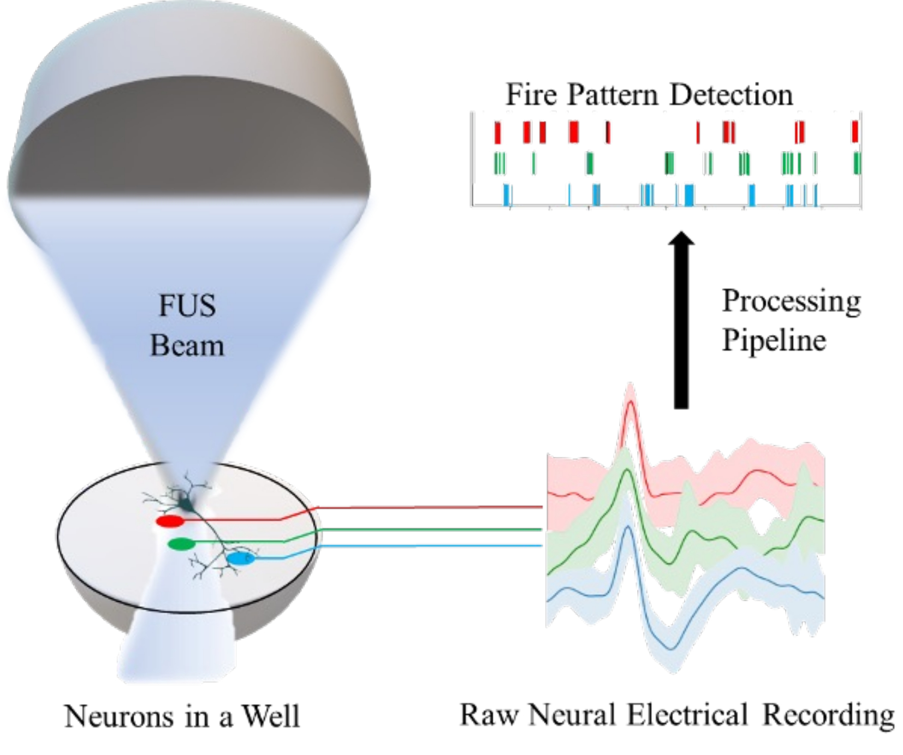
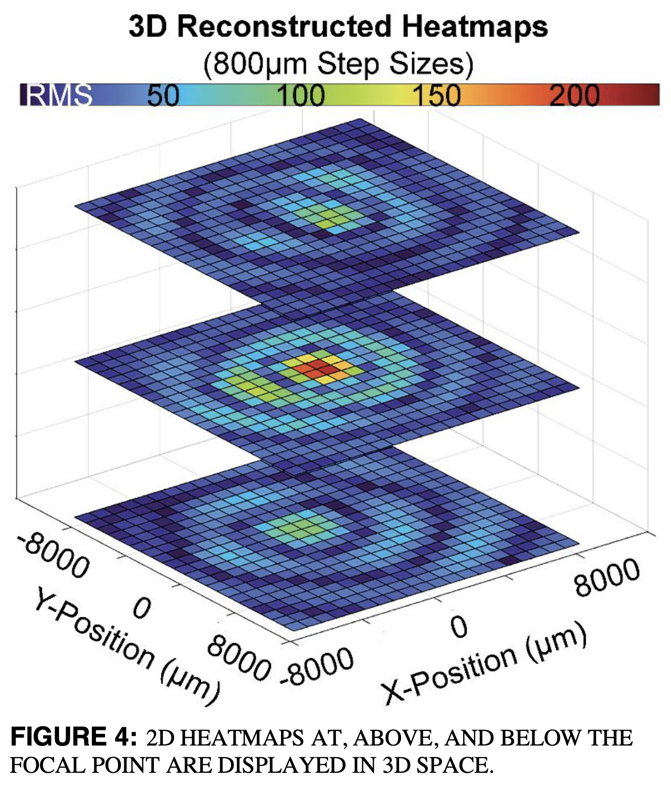

# Projects

## Neural Ultrasound Implant MUSIC

 Salvaging recoverable tissue following an acute spinal cord injury (SCI) remains a challenging aspect of patient care, primarily due to limited therapeutic options and the difficulty in continuously monitoring physiological changes that contribute to deficits[^1]. In response to this and paving way towards neural tissue-sparing human computer interface, we have developed a multifunctional ultrasound-based platform, MUSIC, which offers a comprehensive approach to SCI care and multi-modality functional imaging on spinal cord. This thin and flexible device is designed for placement along the spinal cord following standard decompression surgery, where bone is removed to alleviate pressure.
<iframe width="560" height="315" src="https://www.youtube.com/embed/X1YDXpdL1vA" frameborder="0" allowfullscreen></iframe>

## Focused Ultrasound Therapy

<iframe width="560" height="315" src="https://www.youtube.com/embed/cMTTfhmdqFI" frameborder="0" allowfullscreen></iframe>

## Robot-assisted Surgery (Vision Sensing and Augmented Reality (AR))

## Spotaneous and Natural Conversation Agent (Speech AI)

## Multi-modal Deep Learning 

[^1]: Lorach, Henri, et al. [*Walking naturally after spinal cord injury using a brain–spine interface.*](https://www.nature.com/articles/s41586-023-06094-5) Nature 618.7963 (2023): 126-133.
