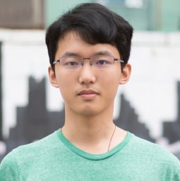

# About Me

Here is **Ruixing Liang (Simon Leung, 梁瑞星)**.

I am a third-year PhD Candidate majoring in Electrical and Computer Engineering at Johns Hopkins University and work at Johns Hopkins Medicine Neurosurgery Department. Currently, I serve as a research assistant at the [HEPIUS Lab](https://www.hopkinsmedicine.org/neurology-neurosurgery/research/hepius), advised by [Prof. Amir Manbachi](https://scholar.google.com/citations?user=EhKqSpIAAAAJ) and [Dr. Nicholas Theodore](https://clinicalconnection.hopkinsmedicine.org/participant/nicholas-theodore-md-ms). **.

If you are interested in any aspect of me, I would love to chat and collaborate, please email me at - *rliang7@jh.edu*

## Academic Background

- **Sep 2022 - Current:** Johns Hopkins University (PhD, ECE)
- **Sep 2021 - June 2023:** Johns Hopkins University (MSE, ECE)
- **Sep 2016 - June 2020:** Chinese University of Hongkong, Shenzhen (CUHK) (BEng, EIE)

## Professional Experiences

---

## Research Interests

- Medical Imaging
- Human Computer Interface
- Focused Ultrasound Therapy
- Surgical Navigation
- Applied Deep Learning in Medicine and Science

My current research focuses on novel engineering solutions to modern surgeries especially for neurosurgery. I am especially passionate about the integration of **Deep Learning** and **Augmented Reality** in **Neural Implants** and **Surgical Navigation**  . My goal is to leverage these advanced technologies to enhance surgical precision and patient outcomes, ultimately contributing to the well-being of society.

<!-- ---

## News and Updates

- **May 2024: **Very excited to pass my Graduate Board Oral exam.  Moving Forward!
- **Dec 2023：**Finished my last graduate course work in Augmented Reality.
- **April 2024：**Our work *BLEGuard* has been accepted to [MobiSys 2024](https://www.sigmobile.org/mobisys/2024/) as a poster paper. See you in Japan!
- **March 2024：**Very excited to get a MPhil offer from Engineering department at Cambridge University!
- **Dec 2023：**Very excited to be selected as [AAAI UC Scholar](https://aaai.org/aaai-conference/undergraduate-consortium-program/). See you in Canada!
- **Aug 2023：**Happy to be awarded the FEPG Scholarship.
- **May 2023：**Happy to be awarded the XiamenAir Scholarship.
- **May 2023：**Collected the Finalist Award in MCM 2023 (Top 1%).
- **Jun 2022：**Started research programme at [Cambridge AI Group](https://www.cl.cam.ac.uk/research/ai/), advised by Prof. Pietro Liò.

<blockquote class="twitter-tweet">
Thrilled to be an AAAI-UC Scholar at <a href="https://twitter.com/hashtag/AAAI24?src=hash&amp;ref_src=twsrc%5Etfw">#AAAI24</a>, thanks to <a href="https://twitter.com/hashtag/AAAI?src=hash&amp;ref_src=twsrc%5Etfw">#AAAI</a> &amp; <a href="https://twitter.com/hashtag/GoogleExploreCSR?src=hash&amp;ref_src=twsrc%5Etfw">#GoogleExploreCSR</a> for the sponsorship. Grateful for the knowledge gained and new friendships formed.  Wonderful trip in Vancouver. Looking forward to staying connected with all.<a href="https://twitter.com/hashtag/AAAI24?src=hash&amp;ref_src=twsrc%5Etfw">#AAAI24</a> <a href="https://twitter.com/hashtag/Vancouver?src=hash&amp;ref_src=twsrc%5Etfw">#Vancouver</a> <a href="https://twitter.com/hashtag/GoogleExploreCSR?src=hash&amp;ref_src=twsrc%5Etfw">#GoogleExploreCSR</a> <a href="https://t.co/wUQUp8XlSM">pic.twitter.com/wUQUp8XlSM</a>
&mdash; Hanlin CAI (seeking a PhD position 2025) (@lancecai2002) <a href="https://twitter.com/lancecai2002/status/1762210025173344260?ref_src=twsrc%5Etfw">February 26, 2024</a></blockquote>  -->

